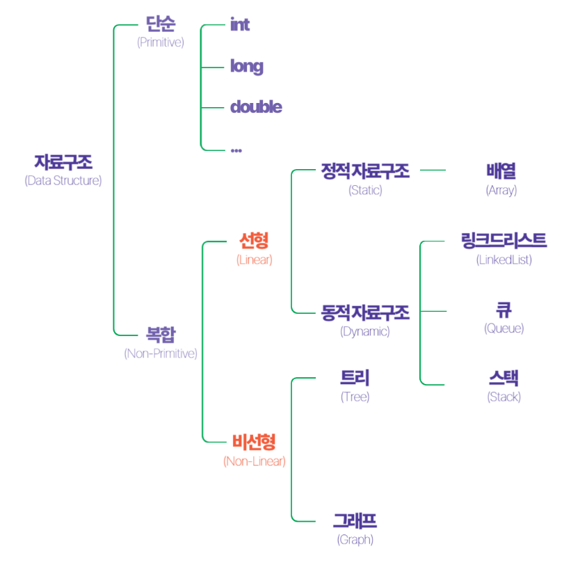

링크 : https://www.youtube.com/watch?v=ysn9dLDNLEU&list=PLsMufJgu5932XYejsOwcUDJ2F75f56nrl&index=3

# 자료구조 ( Data Structure )

자료(data) -> 저장공간 (memory) + 연산 ( 읽기, 쓰기, 삽입, 삭제, 탐색 ) + 구조

# 알고리즘 ( Algorithm )
자료구조를 사용하여 정답을 출력하는 것

    1. 알고리즘, 자료구조, 시간복잡도
    2. 재귀(Recursion)
    3. 선택 알고리즘(Selection)
    4. 분할정복 알고리즘(Divide & Conquer)
    5. 정렬 알고리즘(Sorting)
    6. 동적계획 알고리즘(Dynamic Programming)
    7. 그리디 알고리즘(Greedy)
    8. 백트래킹 알고리즘(Backtracking)
    9. 그래프 알고리즘- 최단경로(Graph algorithm)
    10. 문자열 알고리즘, 기하알고리즘, FFT 알고리즘
    11. 계산복잡도 (Computational Complexity)

# 시간복잡도 ( Big-O 표기법 )
알고리즘의 수행시간 = 최악의 경우의 입력에 대한 기본 연산 횟수
