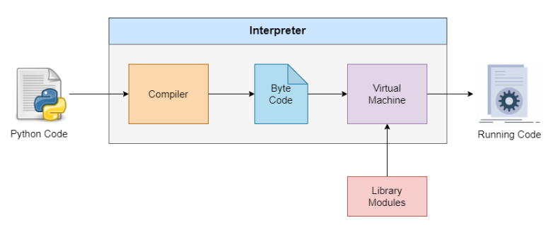

#   Python 

### 유래 
    - 파이썬은 1991년 Guido Van Rossum(귀도 반 로섬)에 의해 만들어진 *인터프리터 프로그래밍 언어이다.
```
v0.9.0 => 일부 데이터 유형 및 오류 처리 함수
v1.0 => map, filter, reduce와 같은 데이터 목록을 쉽게 처리할 수 있는 함수 In 1994
v2,0 => 유니코드 문자 지원 및 목록 루프 알고리즘 간소화 In 2000
v3.0 => print함수, 숫자나누기, 오류 처리에 대한 추가 지원 In 2008
```

### 지향타입
    - 멀티 패러다임 언어로써, 절차적, 함수형, 객체 지향 등 다양한 패러다임을 모두 지원한다.

### 특징
    - 한줄씩 직접 실행 ( 인터프리터 언어 )
    - 영어와 유사한 단어를 사용해 기계어보다는 인간의 언어에 가까움(코드작성에는 쉬우나 런타임은 느려질 수 있다고 생각함)
    - 변수 타입 선언 X
    - 객체 지향 언어
    - 높은 확장성 및 이식성 (글루언어로써 C/C++과 같은 언어를 파이썬과 결합해 사용가능)

### 동작과정
    
    1. 코드 작성
    2. 컴파일러 코드 받은 후 한 줄씩 실행 ( 오류 발생 시 중지 )
    3. 소스 코드 -> 바이트 코드 변환 ( __pycahe__ 폴더에 pyc파일 생성됨)
    4. 바이트 코드 -> PVM(Python Virtual Machine) 전송
    5. PVM이 돌아가면서 오류가 발생하면 오류 메시지 표시
    6. 결과 출력

### 코딩 컨벤션
    - 길고 이어지는 경우에는 ()를 사용하도록 하기, 닫는 괄호는 개행하기 전에 닫기
    - 인덴트(Indent): 공백으로 4칸 들여쓰기
    - import 할때는 연속적으로 하지 않고 별도로 하는게 합리적
    - Blank Lines: 함수 및 클래스 정의 위에는 빈 2줄
    - 한 행에는 최대 79글자까지만 넣도록 함
    - 인라인 주석 문은 코드에서 최소한 두 개 이상의 공백으로 분리되어 있어야 함 + 동일한 행에 써야함
    - 함수, 변수, Attribute는 소문자로 단어 간은 밑줄(_)을 사용하여 연결
    - 클래스는 단어 첫 문자마다 대문자를 써서 연결